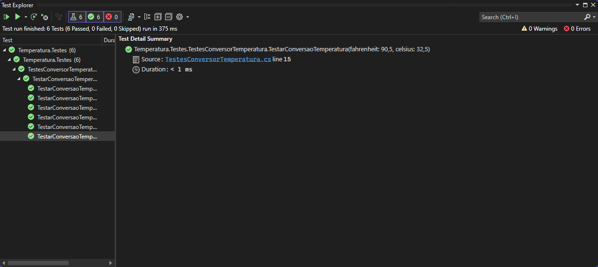
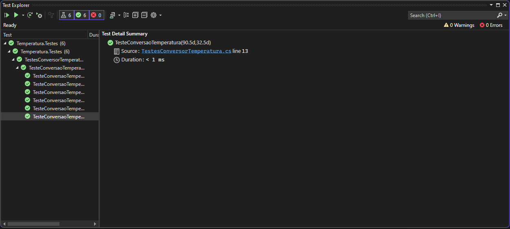
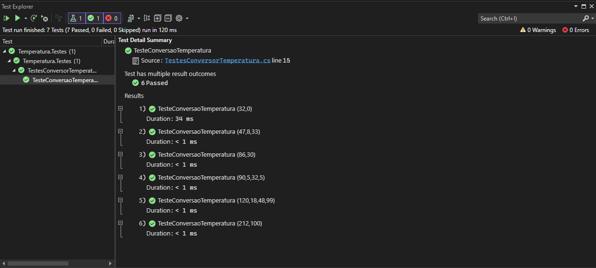
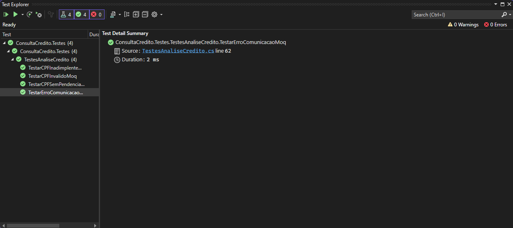
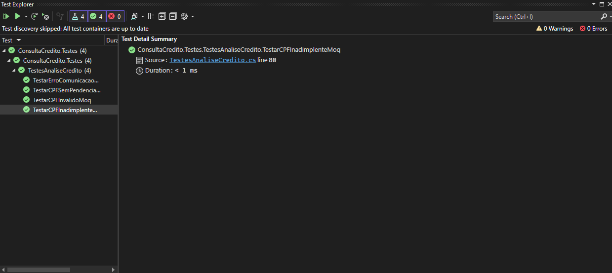

# Aplicando Testes Unitários

## Unit Testing - Conversão de Temperatura

Neste primeiro teste, foi selecionado 6 grupos de valores para testar o algoritmo de conversão de temperatura, foi passado o valor em celsius esperado e o valor em Fahrenheit, sendo que o retorno da função deveria ser o valor em celcius passado, o que de fato aconteceu.

### Usando xUnit

### Usando NUnit

### Usando MSTest

## Unit Testing - Fluent Assertions

Neste teste, foi utilizado Mock Objects para realizar testes unitários de consulta de crédito, mockando a implementação de CPF_INVALIDO, CPF_ERRO_COMUNICACAO, CPF_SEM_PENDENCIAS e CPF_INADIMPLENTE, garantindo que seja possível testar as entradas e saídas sem realizar a implmentação completa das funcionalidades.

### Usando xUnit + Moq

### Usando xUnit + NSubstitute

